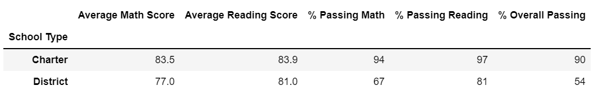

# School District Analysis

## Project Overview
In this projected we helped Maria, the Chief Data Scientist for a shcool district, clean, sort, and analyzed two data sets containing information of different schools and their students. 

The analysis consited of:

- Generating a school district summary (number of students, number of schools, total budget, score averages, passing percentages)
- Generating a school summary (student count per school, budget per student, score averages per school, passing percentages per school)
- Finding high and low performing schools 
- Finding average math and reading scores by grade
- Grouping scores by school spending per student
- Grouping scores by school size
- Groupong scores by school type

After the completion of the above, we were informed that reading and math grades for Thomas High School ninth graders appeared to be altered, and our analysis had to be modified so the results exclude data of that specific group of students.

### Purpose

The purpose of this analysis is to replace the math and reading scores for Thomas High School's ninth graders with NaNs while keeping the rest of the data intact. After completing this, we will repeat the school district analysis, and recreate the metrics previously found.

## Results

- How is the district summary affected?

  The student count decreased from 39,170 to 38,709, and the average math score slightly dropped from 79.0 to 78.0.
  Please see below screenshot of the results prior to replacing data for ninth graders:

  

  Please see below screenshot of the results after replacing data for ninth graders:

  

- How is the school summary affected?

  Most of the averages for Thomas High School were impacted. When we replaced Thomas High School's ninth graders grades with NaNs, the % overall passing rate dropped significantly from 90.95% to 65.08%. This is because we were counting all students in that high school, including ninth graders, but the total number of studios passing the reading or math test was excluding ninth graders.

  Please see below screenshot of the results prior to replacing data for nine graders:
  
  
  

  
  Please see below screenshot of the results after replacing data for ninth graders:
  
  
  
  
  When we excluded ninth graders from Thomas High School from the total count of students, the % overall passing went up to 90.63%.
  
  
  

- How does replacing the ninth graders’ math and reading scores affect Thomas High School’s performance relative to the other schools?
  
  Because we excluded the grades from 9th graders, Thomas High School remained in the #2 position.However, their overall passing rate slightly decreased from 90.95% to 90.63%.
  
- How does replacing the ninth-grade scores affect the following:

  - Math and reading scores by grade
    The math and reading averages did not change for any school. However, the average math and reading score for ninth graders of Thomas High School will now show an "NaN" value.
    
    
    
    
    
    
  - Scores by school spending
    
    

  - Scores by school size
    
    
    

  - Scores by school type

    
    
    

## Summary

Summarize four changes in the updated school district analysis after reading and math scores for the ninth grade at Thomas High School have been replaced with NaNs.

The analysis should contain the following:

Overview of the school district analysis: Explain the purpose of this analysis.

Results: Using bulleted lists and images of DataFrames as support, address the following questions.

How is the district summary affected?
How is the school summary affected?
How does replacing the ninth graders’ math and reading scores affect Thomas High School’s performance relative to the other schools?
How does replacing the ninth-grade scores affect the following:
Math and reading scores by grade
Scores by school spending
Scores by school size
Scores by school type
Summary: Summarize four changes in the updated school district analysis after reading and math scores for the ninth grade at Thomas High School have been replaced with NaNs.
